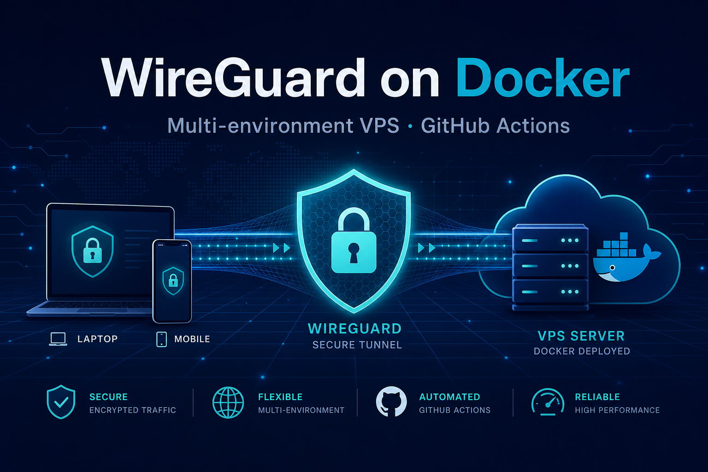

# WireGuard VPN on Docker — multi-stand VPS + GitHub Actions

[](LICENSE)

Self-hosted **WireGuard** ([linuxserver/wireguard](https://docs.linuxserver.io/images/docker-wireguard/)) on **your VPS**: several isolated environments on one server, deploys from **GitHub Actions**, first-time bootstrap via **launchpad** (Docker on your laptop — no `gh` on the host).

<p align="center">
  
</p>

**Repository:** [github.com/panov-id/dockerfile-vpn](https://github.com/panov-id/dockerfile-vpn)

---

## What you get

| Capability | How |
|------------|-----|
| **Production VPN** | Stable **Release** on `main` → production stand |
| **UAT** | GitHub **pre-release** → uat stand (same mechanics, other directory/port) |
| **dev / test** | Push to branch → persistent stand updates |
| **MR preview** | PR into **`dev`** → temporary stand (`pull/N/merge`), torn down on close |
| **One-shot platform setup** | `./scripts/launchpad-run.sh` + `.env.platform` → GitHub envs/secrets, VPS Docker, stands |
| **Multi-server** | Per-environment blocks in `.env.platform` → [multi-server-deployment.md](docs/multi-server-deployment.md) |
| **Teardown VPS** | `TEARDOWN_CONFIRM=yes ./scripts/teardown-platform-run.sh` |
| **Local rehearsal** | `docker-compose.local.yml` + scripts on your laptop |

Each stand has its own **UDP port**, **tunnel subnet**, **Compose project name**, and (with **`STAND_DNS_ZONE`**) hostname — e.g. `dev.vpn.example.com`, `mr-42.vpn.example.com`, apex for production.

---

## Quick start (first time)

**On your laptop:** Docker only. **Secrets:** `.env.platform` (gitignored).

```bash
git clone https://github.com/panov-id/dockerfile-vpn.git
cd dockerfile-vpn
cp .env.platform.example .env.platform
# Edit: GITHUB_TOKEN + each PRODUCTION_*, UAT_*, DEV_*, TEST_*, MR_PREVIEW_* block
./scripts/verify-deploy-ssh-key.sh   # optional; launchpad-run.sh runs this too
./scripts/launchpad-run.sh
```

Then **you** (scripts cannot do this for you):

1. **DNS** — wildcard `*.your-zone` and zone apex → VPS IP ([stands-on-one-vps.md](docs/stands-on-one-vps.md)).
2. **Firewall** — UDP **51820–51823** (prod/uat/test/dev) and **51900+N** for MR previews.
3. **Deploy SSH key** — dedicated key, **no passphrase** → [docs/deploy-ssh-key.md](docs/deploy-ssh-key.md).

**Connect a client:** download `peer1.conf` from the stand’s `config/peer1/` on the VPS.  
**Debian / GNOME (persistent profile, GUI toggle):** [docs/debian-wireguard-client.ru.md](docs/debian-wireguard-client.ru.md).

---

## Workflow in five steps

| Step | Where | What |
|------|--------|------|
| **1** | Laptop | Code; optional local stack (`./scripts/local-compose-up.sh`) |
| **2** | GitHub | **PR into `dev`** → MR preview; merge to `main` later for production |
| **3** | Laptop + VPS | **Once:** launchpad → stands + GitHub wiring |
| **4** | GitHub | Tag on `main` → **publish Release** (pre-release → uat, stable → production) |
| **5** | VPS | Actions run `git checkout` tag + `docker compose up` in `DEPLOY_DIRECTORY` |

**Important:** merge to **`main` alone does not deploy production** — only a **published Release** does.

After step 3: **feature → PR to `dev` → MR preview → merge → dev stand**; production is **`dev` → `main` → Release**.

| Stand | Deploy trigger | Git ref (typical) |
|-------|----------------|-----------------|
| **mr-&lt;N&gt;** | PR into `dev` | `pull/N/merge` |
| **dev** | Push to `dev` | branch `dev` |
| **test** | Push to `test` | branch `test` |
| **uat** | Pre-release published | release tag |
| **production** | Stable release published | release tag |

Details: **[docs/github-workflow.md](docs/github-workflow.md)** · journeys (RU): **[docs/user-experience.md](docs/user-experience.md)**.

---

## Documentation

| Document | Language | Topic |
|----------|----------|--------|
| [docs/README.md](docs/README.md) | — | Index |
| [docs/launchpad.md](docs/launchpad.md) | EN | Launchpad container |
| [docs/multi-server-deployment.md](docs/multi-server-deployment.md) | EN | Per-environment VPS in `.env.platform` |
| [docs/deploy-ssh-key.md](docs/deploy-ssh-key.md) | EN | Deploy key (no passphrase) |
| [docs/stands-on-one-vps.md](docs/stands-on-one-vps.md) | EN | Ports, DNS, GitHub variables |
| [docs/github-workflow.md](docs/github-workflow.md) | EN | Branches, CI, releases |
| [docs/user-experience.md](docs/user-experience.md) | RU | Day-to-day UX |
| [docs/debian-wireguard-client.ru.md](docs/debian-wireguard-client.ru.md) | RU | Debian/GNOME client |
| [docs/server-wizard-user-guide.ru.md](docs/server-wizard-user-guide.ru.md) | RU | VPS wizard prompts |
| [CONTRIBUTING.md](CONTRIBUTING.md) | EN | Contributor entry |

---

## Alternatives to launchpad

| Tool | When |
|------|------|
| [`./scripts/launchpad-run.sh`](scripts/launchpad-run.sh) | **Recommended** — full platform from laptop |
| [`./scripts/interactive-setup.sh`](scripts/interactive-setup.sh) | Menu on laptop (item 8 → launchpad) |
| [`./scripts/server-setup-wizard.sh`](scripts/server-setup-wizard.sh) | Interactive setup **on the VPS** after `git clone` |
| [`./scripts/vps-bootstrap.sh`](scripts/vps-bootstrap.sh) | Non-interactive VPS bootstrap |

---

## Local development (laptop)

Same Compose stack, separate config dir — does not touch the VPS:

```bash
cp .env.local.example .env.local
./scripts/local-compose-up.sh
./scripts/local-smoke-check.sh
```

Two parallel stacks: `./scripts/local-two-stacks-test.sh`. See **`.env.local.example`** for ports and subnets.

---

## CI and automation (in this repo)

| Workflow | Purpose |
|----------|---------|
| `compose-validate.yml` | `docker compose config` on PRs |
| `stand-layout-validate.yml` | Port/subnet/DNS layout |
| `wizard-docker-test.yml` | Wizard in Docker (scripted stdin) |
| `launchpad-scripts-test.yml` | Launchpad helper scripts |
| `deploy-dev-stand.yml` / `deploy-test-stand.yml` | Push to `dev` / `test` |
| `deploy-mr-preview.yml` / `teardown-mr-preview.yml` | MR stands |
| `deploy-release.yml` | **Release published** → uat or production |

Wizard integration test (local):

```bash
docker compose -f docker/docker-compose.wizard-test.yml build wizard-test
WIZARD_TEST_SKIP_COMPOSE_UP=true docker compose -f docker/docker-compose.wizard-test.yml run --rm wizard-test
```

---

## Repository layout

```
docker-compose.yml          # WireGuard service (linuxserver)
docker-compose.local.yml    # Laptop overrides
.env.example                # Per-stand template on VPS (not committed with secrets)
.env.platform.example       # Launchpad / platform secrets template
scripts/
  launchpad-run.sh          # Entry: platform setup in container
  setup-platform.sh         # GitHub + VPS logic
  stand-layout.sh           # Port / subnet / hostname per stand
  remote/vps-deploy-stand.sh
docker/                     # launchpad + wizard-test images
docs/                       # Guides (see docs/README.md)
.github/workflows/          # CI and deploy
```

Generated on the server (never commit): **`config/`**, **`.env`**, WireGuard keys and `peer*.conf`.

---

## Security

- Do **not** commit `.env`, `.env.platform`, or `config/` with keys.
- VPN access requires a **peer private key** — knowing the public IP/port is not enough.
- Use a **deploy key without passphrase** only for automation; restrict who can read `.env.platform` on your laptop.
- Prefer **branch protection** and **environment protection** for `production` / `uat`.

---

## Non-goals

- Public VPN service for strangers (personal / small-team use).
- Bundled admin UI (no wg-easy) — file-based peers under `config/`.
- Full observability stack (see [docs/ROADMAP.md](docs/ROADMAP.md)).

---

## Versioning

- [CHANGELOG.md](CHANGELOG.md) — [Keep a Changelog](https://keepachangelog.com/)
- Tags: [SemVer](https://semver.org/) (`v1.x.y`); deploy workflow checks out the **Release tag**

---

## License

**MIT** — see [LICENSE](LICENSE). You may use, modify, and distribute the code with attribution. No warranty.

The **linuxserver/wireguard** image and **WireGuard** itself are separate projects with their own licenses. This repository is configuration, scripts, and workflows around them.
