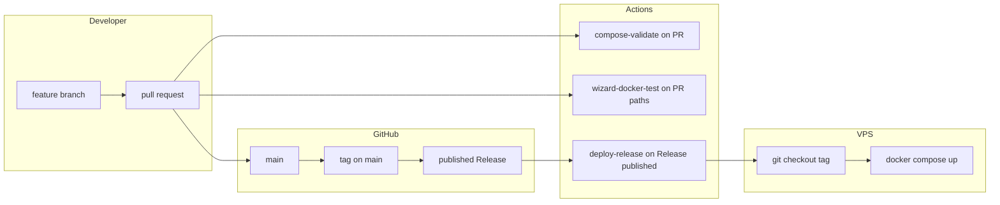

# GitHub workflow for developers

One place to see **how code moves from a branch to the VPS**. Operational setup (SSH keys, `DEPLOY_DIRECTORY`, WireGuard ports) stays in the root [`README.md`](../README.md); this file is the **delivery discipline**.

## TL;DR

1. Branch off **`main`**, open a **pull request**, get review / green checks, **merge to `main`**.
2. Merging to **`main` does not deploy** to the VPS by itself.
3. To ship: create a **semantic version tag** on `main` (for example `v1.1.0`), then **publish a [GitHub Release](https://docs.github.com/en/repositories/releasing-projects-on-github/managing-releases-in-a-repository)** for that tag.
4. **Publishing** the Release triggers [`.github/workflows/deploy-release.yml`](../.github/workflows/deploy-release.yml): the server runs **`git fetch --tags`**, **`git checkout <tag>`**, **`docker compose up -d --pull always`** in **`DEPLOY_DIRECTORY`**.
5. **Pre-release** checkbox → GitHub Environment **`uat`**; stable Release → **`production`** (same workflow, different secrets / variables per environment).

## Branches and merges

| Rule | Detail |
|------|--------|
| Integration branch | **`main`** only |
| Feature work | Topic branches; integrate via **pull request** |
| Direct pushes to `main` | Discouraged — use **branch protection** (required PR, optional required checks) |

## CI on pull requests

| Workflow | When it runs | What it does |
|----------|----------------|--------------|
| [`compose-validate.yml`](../.github/workflows/compose-validate.yml) | PRs touching Compose / env templates | `docker compose config` for production and local merge scenarios |
| [`wizard-docker-test.yml`](../.github/workflows/wizard-docker-test.yml) | PRs touching wizard / Docker test paths | Builds test image, runs scripted wizard (`WIZARD_TEST_SKIP_COMPOSE_UP=true`) |

Fix failures on the PR before merging; **`main`** should stay releasable.

## Releases and deployment

| Step | Action |
|------|--------|
| 1 | Merge completed work to **`main`** |
| 2 | Update [`CHANGELOG.md`](../CHANGELOG.md) (see [Keep a Changelog](https://keepachangelog.com/)) |
| 3 | Tag the release commit on **`main`** with **SemVer** (`vMAJOR.MINOR.PATCH`) |
| 4 | Open **GitHub → Releases → Draft**, choose that tag, add notes, **Publish** |

Important:

- Deploy runs on **`release` → `published`**, not on “tag pushed only”. Publishing the Release is what starts deploy (unless you change the workflow).
- The job uses **`github.event.release.tag_name`** — the server checks out exactly that tag.

### Environments (`uat` vs `production`)

[`deploy-release.yml`](../.github/workflows/deploy-release.yml) selects the GitHub Environment by the Release **pre-release** flag:

| Release type | GitHub Environment |
|--------------|-------------------|
| **Pre-release** (checkbox on) | **`uat`** |
| Stable (pre-release off) | **`production`** |

Configure **`SSH_HOST`**, **`SSH_USER`**, **`SSH_PRIVATE_KEY`**, and **`DEPLOY_DIRECTORY`** (variable) **per environment** in GitHub so UAT and production can point at different paths or hosts.

## Versioning

- **Tags:** `v1.0.0`, `v1.1.0`, … ([Semantic Versioning](https://semver.org/)).
- **Changelog:** [`CHANGELOG.md`](../CHANGELOG.md).
- Routine rhythm (also in README): **feature branch → PR → `main` → tag → Release → deploy**.

## Secrets and variables (reminder)

Nothing secret belongs in Git. On GitHub you store deploy SSH material and set **`DEPLOY_DIRECTORY`**; on the VPS live **`.env`** and WireGuard keys. See the root README **Getting started** and **Security reminders**.

## Where to read more

| Topic | Location |
|-------|----------|
| Full setup, firewall, `DEPLOY_DIRECTORY`, smoke tests | [`README.md`](../README.md) |
| Phased plan / backlog | [`docs/ROADMAP.md`](ROADMAP.md) |
| Multi-tier dev/test/UAT on one VPS | README section **Git workflow** → **Dev / test / UAT on the same VPS** |
