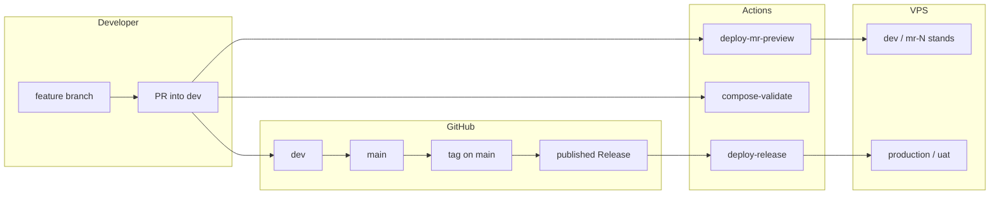

# GitHub workflow for developers

One place to see **how code moves from a branch to the VPS**. If you prefer a short numbered story first, see **README → “Your workflow in five steps”**. Operational setup (SSH keys, `DEPLOY_DIRECTORY`, WireGuard ports) stays in the root [`README.md`](../README.md); this file is the **delivery discipline**.

## TL;DR

Same story as **README → “Your workflow in five steps”**. Day-to-day on features:

1. Branch from **`dev`**, open a **pull request into `dev`** → **MR preview** stand (e.g. `mr-42.vpn.example.com`) deploys **`pull/N/merge`**.
2. Merge PR → **`dev`** stand updates on push to **`dev`**.
3. When ready for production: merge **`dev`** → **`main`**, tag, **publish Release** → **`production`** / **`uat`** via [`.github/workflows/deploy-release.yml`](../.github/workflows/deploy-release.yml).

**Production path** (unchanged):

1. Merging to **`main` does not deploy** by itself.
2. Create a **semver tag** on `main`, **publish a [GitHub Release](https://docs.github.com/en/repositories/releasing-projects-on-github/managing-releases-in-a-repository)**.
3. **Publishing** triggers deploy: **`git fetch --tags`**, **`git checkout <tag>`**, **`docker compose up -d --pull always`** in **`DEPLOY_DIRECTORY`**.
4. **Pre-release** → **`uat`**; stable → **`production`**.

## Branches and merges

| Branch | Role |
|--------|------|
| **`main`** | Production-ready; deploy via **Release** only |
| **`dev`** | Integration for features; **push** updates the **dev** stand; **PRs target `dev`** |
| **`test`** | **Push** updates the **test** stand |
| **feature/\*** | Branch from **`dev`**; open PR **into `dev`** |

| Rule | Detail |
|------|--------|
| Production integration | **`main`** + published Release |
| Feature integration | **Pull request → `dev`** (MR preview stand deploys automatically) |
| Direct pushes to `main` | Discouraged — use **branch protection** |

See **[docs/stands-on-one-vps.md](stands-on-one-vps.md)** for ports, GitHub Environments (`dev`, `test`, `mr-preview`), and workflows.

## CI on pull requests

| Workflow | When it runs | What it does |
|----------|----------------|--------------|
| [`compose-validate.yml`](../.github/workflows/compose-validate.yml) | PRs touching Compose / env templates | `docker compose config` for production and local merge scenarios |
| [`wizard-docker-test.yml`](../.github/workflows/wizard-docker-test.yml) | PRs touching wizard / Docker test paths | Builds test image, runs scripted wizard (`WIZARD_TEST_SKIP_COMPOSE_UP=true`) |
| [`deploy-dev-stand.yml`](../.github/workflows/deploy-dev-stand.yml) | Push to **`dev`** | Persistent **dev** stand on VPS |
| [`deploy-test-stand.yml`](../.github/workflows/deploy-test-stand.yml) | Push to **`test`** | Persistent **test** stand |
| [`deploy-mr-preview.yml`](../.github/workflows/deploy-mr-preview.yml) | PR → **`dev`** | Ephemeral **mr-&lt;N&gt;** stand from **`pull/N/merge`**; comment on PR |
| [`teardown-mr-preview.yml`](../.github/workflows/teardown-mr-preview.yml) | PR → **`dev`** closed | Removes **mr-&lt;N&gt;** stand |
| [`stand-layout-validate.yml`](../.github/workflows/stand-layout-validate.yml) | PRs touching stand scripts | Asserts port/subnet layout |

Fix failures on the PR before merging into **`dev`**.

## Releases and deployment

| Step | Action |
|------|--------|
| 1 | Merge **`dev` → `main`** when production-ready |
| 2 | Update [`CHANGELOG.md`](../CHANGELOG.md) (see [Keep a Changelog](https://keepachangelog.com/)) |
| 3 | Tag the release commit on **`main`** with **SemVer** (`vMAJOR.MINOR.PATCH`) |
| 4 | Open **GitHub → Releases → Draft**, choose that tag, add notes, **Publish** |

Important:

- Deploy runs on **`release` → `published`**, not on “tag pushed only”. Publishing the Release is what starts deploy (unless you change the workflow).
- The job uses **`github.event.release.tag_name`** — the server checks out exactly that tag.

### Environments (`uat` vs `production`)

[`deploy-release.yml`](../.github/workflows/deploy-release.yml) selects the GitHub Environment by the Release **pre-release** flag:

| Release type | GitHub Environment |
|--------------|-------------------|
| **Pre-release** (checkbox on) | **`uat`** |
| Stable (pre-release off) | **`production`** |

Configure **`SSH_HOST`**, **`SSH_USER`**, **`SSH_PRIVATE_KEY`**, and **`DEPLOY_DIRECTORY`** (variable) **per environment** in GitHub so UAT and production can point at different paths or hosts.

## Versioning

- **Tags:** `v1.0.0`, `v1.1.0`, … ([Semantic Versioning](https://semver.org/)).
- **Changelog:** [`CHANGELOG.md`](../CHANGELOG.md).
- Routine rhythm: **feature → PR to `dev` → MR preview → merge → dev stand**; production: **`dev` → `main` → tag → Release → deploy**.

## Secrets and variables (reminder)

Nothing secret belongs in Git. Platform secrets live in **`.env.platform`** (launchpad); GitHub stores deploy SSH and **`DEPLOY_DIRECTORY`** per environment; VPS has **`.env`** and WireGuard keys. See README **Quick start**, **[launchpad.md](launchpad.md)**, and **Security reminders**.

## Where to read more

| Topic | Location |
|-------|----------|
| Doc index | [`docs/README.md`](README.md) |
| Platform setup (Docker, no host `gh`) | [`docs/launchpad.md`](launchpad.md) |
| Full setup, firewall, stands | [`README.md`](../README.md), [`stands-on-one-vps.md`](stands-on-one-vps.md) |
| **VPS server wizard** — every question (Russian) | [`server-wizard-user-guide.ru.md`](server-wizard-user-guide.ru.md) |
| Phased plan / backlog | [`ROADMAP.md`](ROADMAP.md) |
| Multi-tier dev/test/UAT on one VPS | README section **Git workflow** → **Dev / test / UAT on the same VPS** |
