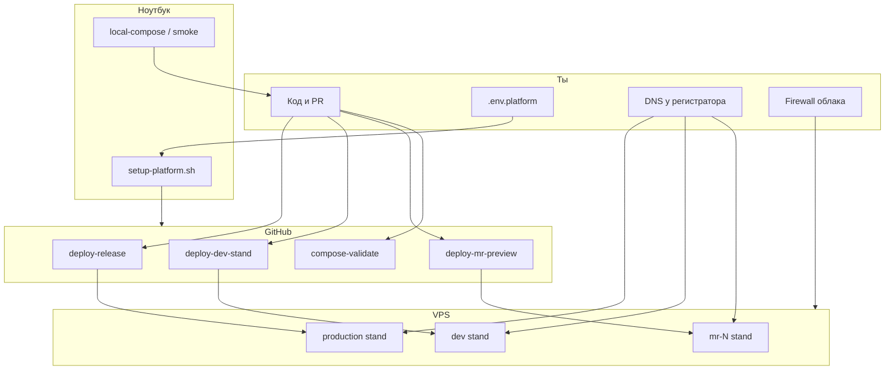

# Пользовательский опыт (User Experience)

Как этот репозиторий **ощущается** для разработчика и владельца VPS: что делаешь ты, что делает автоматика, что видишь в GitHub и на сервере.

Технические детали: [README](../README.md), [github-workflow.md](github-workflow.md), [stands-on-one-vps.md](stands-on-one-vps.md), [server-wizard-user-guide.ru.md](server-wizard-user-guide.ru.md).

---

## Роли

| Роль | Обычно кто | Главная цель |
|------|-----------|--------------|
| **Разработчик** | Ты на ноутбуке | Написать код, проверить на стенде, смержить в `dev`, потом в `main` |
| **Владелец платформы** | Ты же, один раз | Поднять VPS, DNS, секреты GitHub — без ручного копипаста в UI |
| **Пользователь VPN** | Ты или команда | Подключиться по WireGuard к нужному стенду (dev / MR / production) |

Сейчас все стенды **на одном VPS**; позже можно разнести по серверам без смены привычного процесса.

---

## Первая настройка (один раз)

### Что ты делаешь

1. Клонируешь репозиторий на ноутбук.
2. Копируешь шаблон: `cp .env.platform.example .env.platform`.
3. Заполняешь секреты в файле: VPS, SSH-ключ (путь на диске), **`GITHUB_TOKEN`** (PAT), зона DNS (`vpn.example.com`).
4. Запускаешь: **`./scripts/launchpad-run.sh`** — на хосте нужен **только Docker**, без `gh` и без `apt install`.

Контейнер **launchpad** сам ставит внутри себя `gh`/`git`/`ssh` и выполняет настройку.

### Что происходит без твоего участия

- В GitHub создаются **Environments** и заливаются **секреты/переменные** для `production`, `uat`, `dev`, `test`, `mr-preview`.
- На origin появляются ветки **`dev`** и **`test`**, если их ещё не было.
- По SSH на VPS: каталоги стендов, clone репозитория, `.env` с правильными портами и hostname, `docker compose up` для выбранных стендов (`dev`, `test`, `uat`, `production` по умолчанию).
- Локально (если есть Docker): проверка `docker compose config`.

### Что остаётся только у тебя (вне скриптов)

| Действие | Где | Зачем |
|----------|-----|--------|
| DNS `*.vpn.example.com` → IP VPS | Панель регистратора / Cloudflare | Чтобы `mr-42.vpn.example.com` и `dev.vpn.example.com` резолвились |
| UDP-порты в firewall облака | Hetzner, DO, … | WireGuard ходит по UDP (51820–51823, 51900+ для MR) |
| `GITHUB_TOKEN` в `.env.platform` | Файл на диске | PAT для GitHub API внутри launchpad (без `gh` на хосте) |

После этого **повторять setup-platform** нужно только если сменился VPS, ключ или зона DNS.

---

## Ежедневная работа: новая фича

Путь, который задуман как «нормальный день разработчика».

```text
ноутбук                    GitHub                         VPS (один сервер)
────────                   ──────                         ────────────────

правки кода
    │
    ├─ опционально: local-compose-up / smoke
    │                 (только твой ПК, config.local)
    │
    v
git push feature/xyz
    │
    v
открываешь PR ──────────►  CI: compose-validate
    в ветку dev            (и wizard-test при изменении визарда)
    │
    │                      deploy-mr-preview
    │                           │
    │                           v
    │                      стенд mr-<N>
    │                      pull/N/merge
    │                      mr-42.vpn.example.com:51942
    │
    ◄──────────────────  комментарий в PR:
                         host, port, каталог на VPS

ты подключаешься WireGuard
к mr-42.vpn.example.com
и «щупаешь» результат
ДО нажатия Merge

    │
    v
Merge в dev ───────────►  push dev
                               │
                               v
                          стенд dev обновился
                          dev.vpn.example.com:51823

    │
    v (когда готово к prod)
merge dev → main
    │
    v
тег v1.2.0 + Release ──►  deploy-release
    (pre-release → uat)         │
    (stable → production)       v
                          checkout тега
                          vpn.example.com:51820
```

### Что ты **не** делаешь вручную

- Не SSH на сервер ради каждого деплоя feature-ветки.
- Не создаёшь отдельный DNS на каждый MR (достаточно wildcard `*.vpn.example.com`).
- Не поднимаешь контейнеры для MR-preview — workflow сам checkout merge-ref и `compose up`.

### Что ты **видишь**

| Место | Обратная связь |
|-------|----------------|
| **PR → Checks** | Зелёный/красный `compose-validate`, при необходимости `wizard-docker-test` |
| **PR → Comment** | Блок «MR preview stand»: DNS, UDP-порт, путь на VPS |
| **Actions** | Логи `Deploy merge request preview`, `Deploy dev stand`, … |
| **После Merge в dev** | Workflow на push в `dev` — обновление постоянного dev-стенда |

### Если PR не мержится в `dev`

Конфликты → GitHub **не отдаёт** `pull/N/merge` → preview-деплой **падает**. Ты видишь красный job; после разрешения конфликтов — новый push в PR → preview пересобирается.

---

## Стенды с точки зрения пользователя

Один физический сервер, **разные «виртуальные» VPN** — разный адрес и порт в клиенте.

| Стенд | Когда живёт | Как подключиться (пример) | Смысл |
|-------|-------------|-----------------------------|--------|
| **mr-42** | Пока PR открыт | `mr-42.vpn.example.com:51942` | «Как будет после merge в dev» |
| **dev** | Постоянно | `dev.vpn.example.com:51823` | Интеграция после merge |
| **test** | После push в `test` | `test.vpn.example.com:51822` | Отдельная линия для test-ветки |
| **uat** | Pre-release | `uat.vpn.example.com:51821` | Как prod, но из pre-release |
| **production** | Stable Release | `vpn.example.com:51820` | Боевой |

Конфиги пиров лежат в `config/` **внутри каталога стенда** на VPS (не в git).

---

## Путь в production (релиз)

1. Код в **`main`** (часто через merge из `dev`).
2. Ты создаёшь **тег** и **публикуешь Release** на GitHub.
3. **Merge в `main` сам по себе VPS не трогает** — только Release.
4. Actions заходят на production-каталог, `git checkout` тега, `docker compose up`.
5. Ты проверяешь: клиент на `vpn.example.com`, или `docker compose ps` по SSH.

**Pre-release** → окружение **uat** (тот же механизм, другой каталог/порт/DNS).

---

## Локальная разработка (ноутбук)

Отдельный мир: **не бьёт по VPS**.

| Действие | Команда | Ощущение |
|----------|---------|----------|
| Поднять стек | `./scripts/local-compose-up.sh` | WireGuard в Docker, порт из `.env.local` (часто 51830) |
| Smoke | `./scripts/local-smoke-check.sh` | «Порт слушает, wg0.conf есть» |
| Два стека сразу | `./scripts/local-two-stacks-test.sh` | Репетиция двух VPS на одной машине |

Файлы: `.env.local`, `config.local/` — в `.gitignore`.

---

## Альтернативные входы (если не setup-platform)

| Сценарий | Инструмент | Когда |
|----------|------------|--------|
| Полная автоматика | `setup-platform.sh` + `.env.platform` | **Рекомендуется** |
| Интерактивное меню на ноутбуке | `interactive-setup.sh` | Пункт 8 = тот же setup-platform |
| Первый VPS вручную по SSH | `server-setup-wizard.sh` | Уже на сервере после `git clone`, пошаговые вопросы |
| Без вопросов на VPS | `vps-bootstrap.sh` | Root + env vars, один прогон |

Визард на VPS и `setup-platform` **не дублируют** друг друга: platform — с ноутбука «всё сразу»; визард — если настраиваешь сервер отдельно.

---

## Карта «кто за что отвечает»



---

## Ожидания и ограничения (честно)

| Ожидание | Реальность |
|----------|------------|
| «Запушил в feature — сразу на prod» | **Нет.** Prod только через **Release** с `main`. |
| «MR preview = моя ветка как есть» | **Нет.** Это **merge в dev** (`pull/N/merge`), не tip feature-ветки. |
| «Один hostname на всё» | Только без `STAND_DNS_ZONE`. С зоной — **отдельный DNS на стенд**. |
| «Ничего не трогать в DNS» | Нужен хотя бы **wildcard** на VPS IP. |
| «1000 открытых MR одновременно» | Порты MR: 51900+N, лимит ~1099 по формуле. |

---

## Краткая шпаргалка команд

| Задача | Команда |
|--------|---------|
| Всё настроить с ноутбука | `./scripts/setup-platform.sh` |
| Алиас | `source scripts/platform-aliases.sh` → `vpn-setup` |
| Локальный VPN | `./scripts/local-compose-up.sh` |
| Проверить compose | `./scripts/compose-config-check.sh` |
| Hostname стенда | `STAND_DNS_ZONE=vpn.example.com ./scripts/stand-resolve-public-host.sh mr 42` |
| Визард на VPS (ручной) | `./scripts/server-setup-wizard.sh` |

---

## Связанные документы

| Документ | Содержание |
|----------|------------|
| [README.md](../README.md) | Цели, 5 шагов, layout репозитория |
| [CONTRIBUTING.md](../CONTRIBUTING.md) | Куда смотреть новому участнику |
| [github-workflow.md](github-workflow.md) | Ветки, CI, Release (EN) |
| [stands-on-one-vps.md](stands-on-one-vps.md) | Порты, DNS, variables |
| [server-wizard-user-guide.ru.md](server-wizard-user-guide.ru.md) | Каждый вопрос визарда на VPS |
